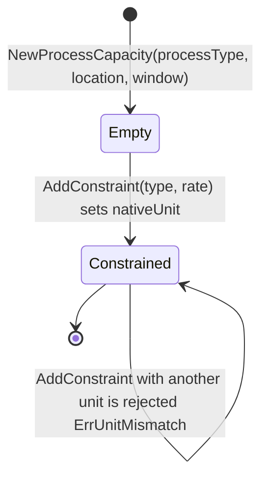
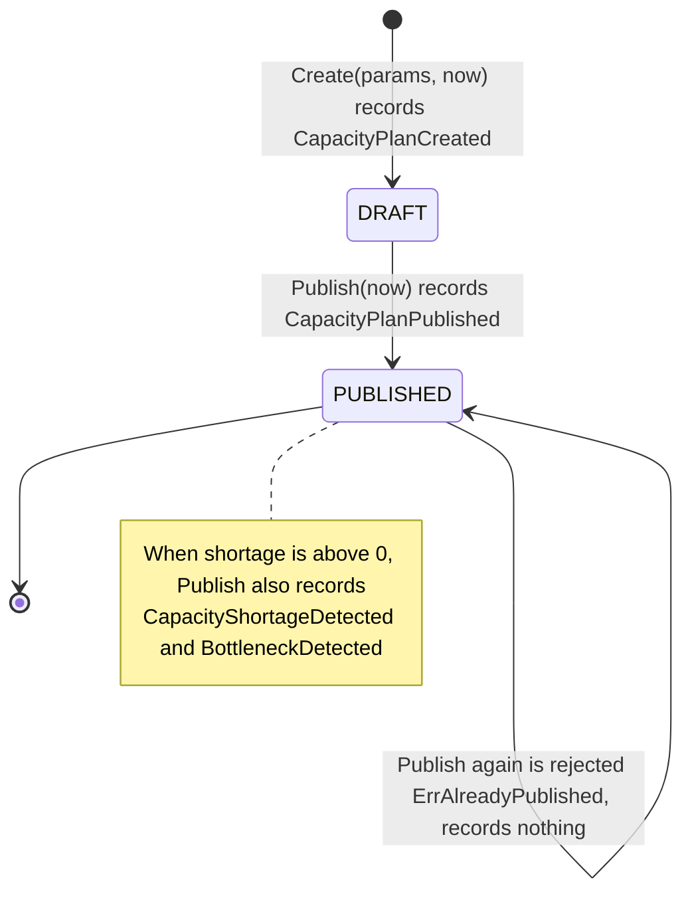

# Aggregate design canvas

Following the ddd-crew [Aggregate Design Canvas v1.1](https://github.com/ddd-crew/aggregate-design-canvas),
one section per aggregate root in `internal/domain`. There are two:
`ProcessCapacity` and `CapacityPlan`. Read models are listed at the end.

## ProcessCapacity

### 1. Name

`ProcessCapacity` (`internal/domain/processcapacity/process_capacity.go`).

### 2. Description

The usable throughput of one warehouse process at one site for one time
window: the minimum across its registered constraints (LABOR, LOCATION,
EQUIPMENT, STATION, CONVEYOR, BUFFER, REPLENISHMENT). Identity is
`(ProcessType, Location, CapacityWindow)`, an exact key; whether it applies to a
planning window is decided by window coverage outside the aggregate
(`CapacityWindow.Covers`, ADR 0003).

### 3. State Transitions

The aggregate has no status enum. Its only state change is the first
`AddConstraint`, which fixes the native unit (`nativeUnitSet`).

Source: `internal/domain/processcapacity/process_capacity.go`,
`internal/application/usecases/register_process_capacity_constraint.go`.
Omits: deletion (no code deletes a `ProcessCapacity` except migration `0005`'s
one-off cleanup of legacy rows). `Empty` is transient: the use case always
adds a constraint before saving.

### 4. Enforced Invariants

| Invariant | Enforced by |
| --- | --- |
| All constraints share one native unit, set by the first constraint | `AddConstraint` returns `ErrUnitMismatch` |
| One rate per constraint type; re-registering replaces it in place, keeping its position | `AddConstraint` (`order` + `constraints` map) |
| A rate's quantity is not negative and its period is positive | `NewCapacityRate`: `ErrNegativeQuantity`, `ErrNonPositivePeriod` |
| The window's end is strictly after its start | `NewCapacityWindow`: `ErrInvalidWindow` |
| No effective rate without a constraint | `EffectiveRate` returns `ErrNoConstraints` |
| Ties in the effective rate go to the earliest-registered constraint | `EffectiveRate` iterates `order` (persisted as `ordinal`) |

### 5. Corrective Policies

- A Kafka `ShiftPlanCommitted` that fails one of these rules is a deterministic
  rejection (`usecases.IsDomainValidationError`): it is logged, its
  processed-event claim is committed and it is never retried.
- A REST caller gets `400 invalid-capacity-window`, `422 negative-quantity` /
  `non-positive-period`, or `409 unit-mismatch` (statuses from `statusFor` in
  `internal/adapters/inbound/http/errors.go`); an MCP caller gets the same
  slugs as tool errors. Either must correct the request.

### 6. Handled Commands

| Command | Use case | Inbound |
| --- | --- | --- |
| `RegisterProcessCapacityConstraintCommand` | `RegisterProcessCapacityConstraint.Handle` (find or create, `AddConstraint`, save) | `POST /process-capacities`, MCP `register_process_capacity_constraint`, and `LaborCapacityConsumer` |

### 7. Created Events

None. `ProcessCapacityRegistered` and `ProcessCapacityChanged` are domain
vocabulary only; nothing raises or publishes them.

### 8. Throughput (estimate)

*Estimate, not measured.* Writes: one per `ShiftPlanCommitted` fan-out line
(a few per shift plan, a handful of shift plans per site per day) plus rare
operator registrations. Reads: once per path step on every path-capacity query
and plan creation (`FindCovering`). Concurrency on one instance is low: two
writes to the same `(process, site, window)` are rare.

### 9. Size (estimate)

*Estimate.* Up to 7 constraints per instance (one per `ConstraintType`).
Lifetime is the length of its window (hours to a few days); instances are never
deleted, so the table grows with every committed shift.

## CapacityPlan

### 1. Name

`CapacityPlan` (`internal/domain/capacityplan/capacity_plan.go`).

### 2. Description

The demand assigned to a warehouse site and planning window, evaluated against
the composed capacity of one `ProcessPath`: path capacity (ORDER per hour),
capacity over the window, shortage and bottleneck step, plus the informational
binding constraint and composition warnings. Identity is a UUID string; the
natural key `(WarehouseID, PlanningWindow)` is not unique. The aggregate does
no I/O: `Create` receives the already-computed path rate.

### 3. State Transitions

Source: `internal/domain/capacityplan/capacity_plan.go` (`StatusDraft`,
`StatusPublished`, `Create`, `Publish`), `internal/domain/capacityplan/events.go`.
Omits: `Rehydrate`, which rebuilds a stored plan in either state without
recording events, and the absence of any delete or un-publish.

### 4. Enforced Invariants

| Invariant | Enforced by |
| --- | --- |
| id, warehouse id, location and process path id are not blank | `Create` returns `ErrRequiredField` |
| Assigned demand is not negative (zero is valid) | `Create` returns `ErrNegativeDemand`; also `CHECK (assigned_demand >= 0)` |
| The path rate is an ORDER rate | `Create` returns `ErrPathRateNotOrder` |
| `shortage = max(0, demand - capacityOverWindow)`, never negative; equal is not a shortage | `Create` (`math.Max`); `CHECK (shortage >= 0)` |
| A plan is published at most once | `Publish` returns `ErrAlreadyPublished` |
| Each recorded event is handed over exactly once | `PullEvents` clears the slice |
| The window is valid | `processcapacity.NewCapacityWindow` in the use case (`ErrInvalidWindow`); `CHECK (window_end > window_start)` |

### 5. Corrective Policies

- An omitted `assigned_demand` with no expected orders is rejected
  (`ErrMissingAssignedDemand`, `422 missing-assigned-demand`) rather than
  creating a zero-demand plan (ADR 0004).
- A second publish returns `409 capacity-plan-already-published` and queues no
  event, so downstream consumers never see the shortage twice.
- Concurrent publishes of one plan serialize on the Postgres row lock taken by
  `FindByID` inside the unit of work.

### 6. Handled Commands

| Command | Use case | Inbound |
| --- | --- | --- |
| `CreateCapacityPlanCommand` | `CreateCapacityPlan.Handle` | `POST /capacity-plans`, MCP `create_capacity_plan` |
| publish by id | `PublishCapacityPlan.Handle` | `POST /capacity-plans/{id}/publish`, MCP `publish_capacity_plan` |

### 7. Created Events

| Event | When | Full CloudEvents type |
| --- | --- | --- |
| `CapacityPlanCreated` | `Create` | `com.warehouse.wes.warehouse-planning.capacityplan.CapacityPlanCreated` |
| `CapacityPlanPublished` | `Publish`, always | `com.warehouse.wes.warehouse-planning.capacityplan.CapacityPlanPublished` |
| `CapacityShortageDetected` | `Publish`, only when `shortage > 0` | `com.warehouse.wes.warehouse-planning.capacityplan.CapacityShortageDetected` |
| `BottleneckDetected` | `Publish`, only when `shortage > 0` | `com.warehouse.wes.warehouse-planning.capacityplan.BottleneckDetected` |

Each is written twice by the outbox: on `warehouse.warehouse-planning.events`
and on `warehouse.warehouse-planning.analytics`, under one CloudEvents id.

### 8. Throughput (estimate)

*Estimate, not measured.* Created by planners or the ops agent's tooling a few
times per site per shift; published once. No hot instance: each plan is
written twice in its life (create, publish) and then only read.

### 9. Size (estimate)

*Estimate.* 2 to 4 domain events per instance over its lifetime (Created;
Published; plus ShortageDetected and BottleneckDetected when short), i.e. 4 to
8 outbox rows. The row is small (scalar fields, a short warnings array) and
lives forever; there is no archival.

## Not aggregates: read models and value objects

| Model | Kind | Where | Why it is not an aggregate |
| --- | --- | --- | --- |
| `processpath.ProcessPath` | Operator-declared read model | `internal/domain/processpath`, table `process_paths` | Construction only, no mutation method; re-registering replaces it wholesale |
| `processcapacity.StationStandard` | Value object, stored | table `station_standards` | Immutable, keyed `(location, process type)`, upserted whole |
| `demand.Order` / `demand.Summary` | Read model of order-management orders | `internal/domain/demand`, table `order_demand` | Last-writer-wins projection of upstream events, no invariant beyond validation |
| Facility tally | Read model of facility-layout slots | `internal/application/tally`, tables `location_slot_tally`, `location_slot_registration` | A count, not a throughput; maintained by the consumer only |
| `ProcessPathCapacity` (`PathCapacityResult`) | Domain service result | `ComposeProcessPathCapacity` | Computed at read time, never stored (ADR 0002) |
| `plan_facts` | Analytics projection | `analytics/migrations`, `internal/adapters/outbound/analyticsstore` | Derived from the analytics stream (ADR 0005) |
