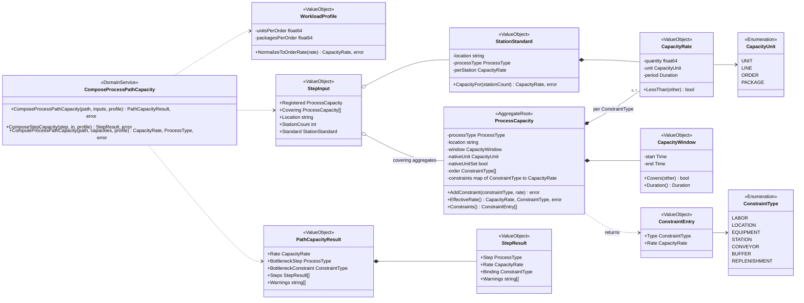
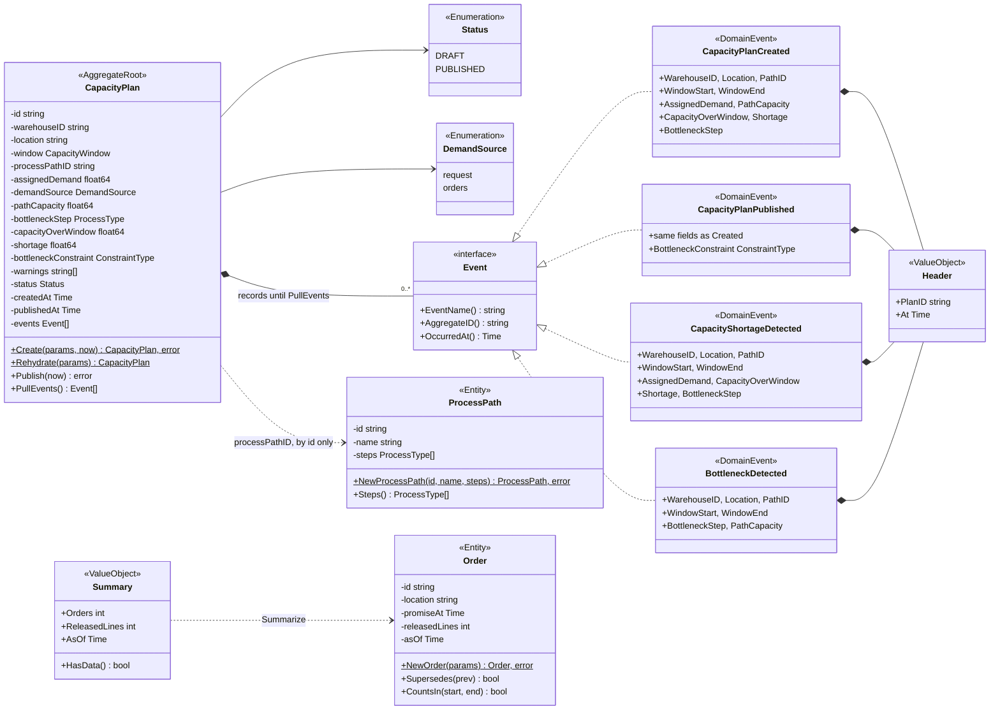
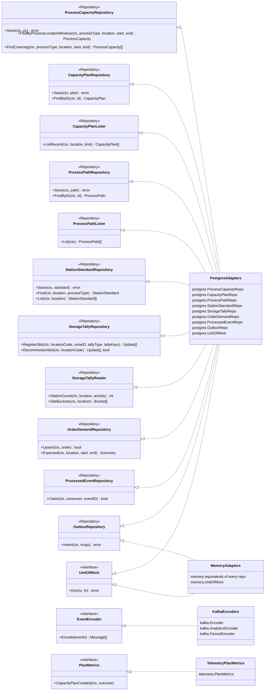
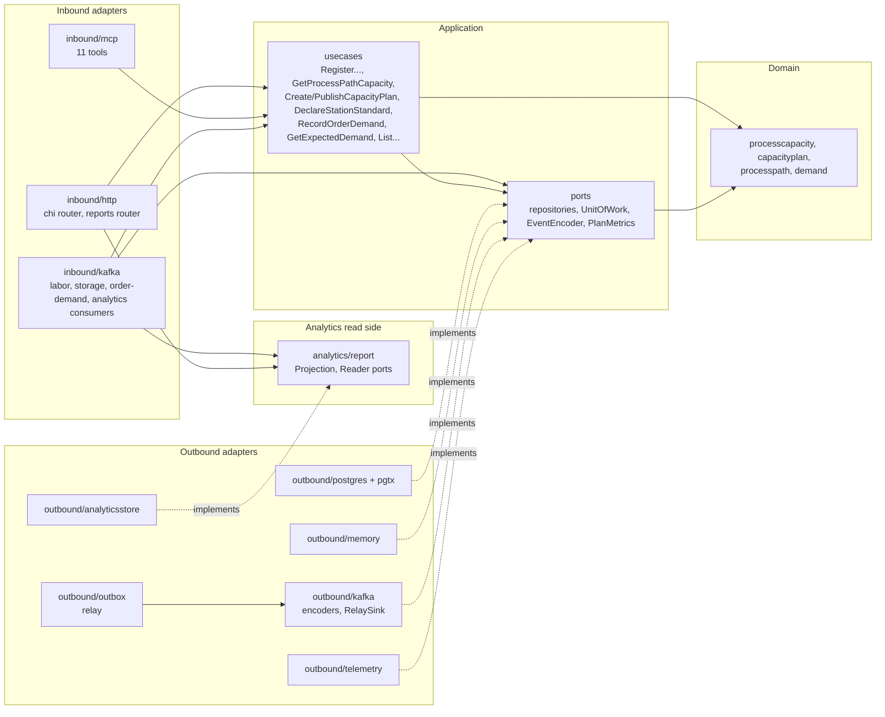

# Class diagrams

UML class diagrams of `internal/domain/**`, split by package, then the
hexagonal ports and the adapters that implement them. Field and method names
are the real Go identifiers (unexported fields keep their lower-case names);
only state-changing methods and the key queries are shown.

Stereotypes: `<<AggregateRoot>>`, `<<Entity>>`, `<<ValueObject>>`,
`<<Enumeration>>`, `<<DomainEvent>>`, `<<DomainService>>` (a plain Go function
drawn as a class) and `<<Repository>>` (an outbound port).

## Package `processcapacity`

Source: `internal/domain/processcapacity/process_capacity.go`,
`capacity_rate.go`, `capacity_window.go`, `workload_profile.go`,
`station_standard.go`, `step_capacity.go`, `process_path_capacity.go`.
Omits: getters, `SortNewestFirst`, the sentinel errors (listed on the
[aggregate design canvas](/docs/ddd/aggregate-design-canvas)) and
`ErrMissingStepCapacity`. `ProcessType` is a plain string type.

## Packages `capacityplan`, `processpath` and `demand`

Source: `internal/domain/capacityplan/capacity_plan.go`, `events.go`,
`internal/domain/processpath/process_path.go`, `internal/domain/demand/order.go`.
Omits: `CreateParams` / `RehydrateParams` / `OrderParams`, getters, sentinel
errors, and `CapacityPlan`'s `CapacityWindow` (drawn in the first diagram).
Event fields are grouped per line for readability. `Order` is the entity of a
read model, not an aggregate root.

## Ports and adapters

Source: `internal/application/ports/*.go`,
`internal/adapters/outbound/postgres/*.go`, `internal/adapters/outbound/memory/*.go`,
`internal/adapters/outbound/kafka/encoder.go`, `analytics_encoder.go`,
`internal/adapters/outbound/telemetry/metrics.go`.
Omits: the `ctx` / error result details, every memory implementation edge but
two (each port has a memory implementation), the analytics ports
(`report.Projection`, `report.Reader`, implemented by `analyticsstore`), which
sit outside the OLTP ports, and the relay's own `outbox.Store` / `outbox.Sink`
interfaces.

## Hexagonal view

Source: `internal/architecture/architecture_test.go` (the dependency rule),
`cmd/api/main.go`, `cmd/mcp/main.go`, `cmd/planning-projector/main.go`,
`cmd/planning-reports/main.go`.
Omits: the composition roots in `cmd/*` (the only place layers are wired) and
the CloudEvents helper `internal/adapters/kafka/cloudevents` used by both Kafka
adapters. `KIN --> REP` is the analytics consumer writing through
`report.Projection`; `HTTP --> REP` is the reports router reading through
`report.Reader`; the OLTP layers never import either (arch-test). The
`KIN --> PORTS` edge is the storage consumer writing the tally and claims
without a use case.
