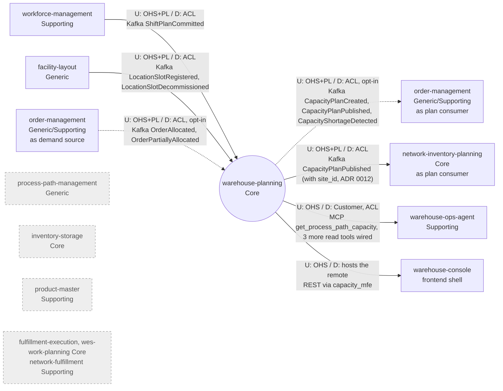

# Context map

This context's slice of the fleet map, following ddd-crew
[Context Mapping](https://github.com/ddd-crew/context-mapping). Every edge is
labelled `U` (upstream) / `D` (downstream) with the pattern on each side and
the technology. Solid edges are live in code, dotted edges are wired but opt-in
or partly unused, and the grey nodes are deliberately absent relationships.

Source: `internal/adapters/inbound/kafka/labor_capacity_consumer.go`,
`storage_capacity_consumer.go`, `order_demand_consumer.go`,
`internal/adapters/outbound/kafka/encoder.go`, `cmd/api/main.go`,
`cmd/api/demand.go`, `internal/adapters/inbound/mcp/tools.go`, `web/src/api.ts`,
ADR 0001 and its Addendum, ADR 0004; on the sibling side
`order-management` `internal/adapters/inbound/kafka/planned_capacity_consumer.go`,
`network-inventory-planning` `internal/adapters/inbound/kafka/consumers.go`,
`warehouse-ops-agent` `internal/adapters/outbound/mcpclient/warehouse_planning.go`
and `warehouse-console` `src/App.tsx` (all on `develop`).
Omits: this context's own analytics topic and projector (internal, not a
context relationship), the dead-letter topics, and the Kafka broker, Kong and
Nginx infrastructure. `order-management` is drawn twice only to keep the
upstream and downstream edges readable; it is one context.

## Relationships

| # | Upstream | Downstream | Patterns (U / D) | Technology | Status | Evidence |
| --- | --- | --- | --- | --- | --- | --- |
| 1 | `workforce-management` | `warehouse-planning` | OHS + Published Language / Anti-Corruption Layer: the payload is hand-mirrored (`shiftPlanCommittedData`) and translated into a LABOR `CapacityConstraint` with an assumed UNIT/HOUR unit and a derived window | Kafka `warehouse.workforce.events`, `com.warehouse.wes.workforce-management.shiftplan.ShiftPlanCommitted` | **Live** (group `LABOR_CAPACITY_CONSUMER_GROUP`) | `internal/adapters/inbound/kafka/labor_capacity_consumer.go` |
| 2 | `facility-layout` | `warehouse-planning` | OHS + PL / ACL: slots are folded into a tally, never into a capacity (ADR 0002) | Kafka `warehouse.facility.events`, `com.warehouse.wms.facility-layout.locationslot.LocationSlotRegistered` and `...LocationSlotDecommissioned` | **Live** (group `STORAGE_CAPACITY_CONSUMER_GROUP`) | `internal/adapters/inbound/kafka/storage_capacity_consumer.go` |
| 3 | `order-management` | `warehouse-planning` | OHS + PL / ACL: an order becomes a `demand.Order` attributed to one configured site | Kafka `warehouse.order-management.events`, `com.warehouse.wes.order-management.order.OrderAllocated` and `...OrderPartiallyAllocated` | **Wired, opt-in**: off unless `DEMAND_CONSUMER_GROUP` is set (ADR 0004) | `internal/adapters/inbound/kafka/order_demand_consumer.go`, `cmd/api/demand.go` |
| 4 | `warehouse-planning` | `order-management` | OHS + PL / ACL (local read model, per order-management's own context map) | Kafka `warehouse.warehouse-planning.events`, `com.warehouse.wes.warehouse-planning.capacityplan.*` | **Wired, opt-in** on the consumer side (`PLANNED_CAPACITY_CONSUMER_GROUP` in order-management); it acts on Created, Published and ShortageDetected and ignores `BottleneckDetected` | this repo: `internal/adapters/outbound/kafka/encoder.go`; order-management: `planned_capacity_consumer.go` (its ADR 0031) |
| 5 | `warehouse-planning` | `warehouse-ops-agent` | OHS / Customer with an ACL (its MCP client adapter) | MCP Streamable HTTP, read tools only | **Live** for `get_process_path_capacity` (the agent's daily-brief capacity outlook); `get_capacity_plan`, `get_storage_capacity`, `list_station_standards` **wired but unused** (its ADR 0013) | `internal/adapters/inbound/mcp/tools.go`; ops-agent `internal/adapters/outbound/mcpclient/warehouse_planning.go` |
| 6 | `warehouse-planning` | `warehouse-console` | OHS; the console only hosts this context's own Module Federation remote `capacity_mfe`, which calls this service's REST API through Kong | REST (`/api/warehouse-planning`) | **Live** | `web/src/api.ts`, `web/vite.config.ts`; console `src/App.tsx` |
| 7 | `process-path-management` | none | **Separate Ways**: its `ProcessPath` has no physical step sequence; the two contexts share the `path_id` string only as a human cross-reference | none | **Deliberately absent** (ADR 0001 Addendum) | no consumer exists; `POST /process-paths` declares paths locally |
| 8 | `inventory-storage` | none | **Separate Ways**: stock is not capacity | none | **Deliberately absent** (ADR 0001) | no consumer, no client |
| 9 | `fulfillment-execution`, `wes-work-planning` (observed capacity), `network-fulfillment` (demand) | `warehouse-planning` | Published Language intended | Kafka (intended) | **Planned, not implemented** (ADR 0001 context map) | none |
| 10 | `product-master` | none | No relationship: SKU master data (handling classification, unit dimensions and weight) is not a capacity input; `product-master` publishes `warehouse.product-master.events` and calls no sibling | none | **Absent** | no consumer of `warehouse.product-master.events` and no client in this repo; `product-master` (its ADR 0001) has no outbound client and consumes nothing from this context |
| 11 | `warehouse-planning` | `network-inventory-planning` | OHS + PL / ACL on NIP's side (it folds each published plan into its own `PublishedCapacityPlan` read model and refuses to plan from a stale or missing one) | Kafka `warehouse.warehouse-planning.events`, `com.warehouse.wes.warehouse-planning.capacityplan.CapacityPlanPublished`; NIP needs the additive canonical `site_id` this context adds in ADR 0012 | **Live** on NIP's side (its `CAPACITY_PLAN_CONSUMER_GROUP`); exercised by the e2e inter-warehouse-transfer scenario, where plans created through this service's REST API and relayed by its outbox are what let NIP approve a transfer | this context: `capacityplan.CapacityPlanPublished` and its `site_id` (ADR 0012); NIP: `internal/adapters/inbound/kafka/consumers.go` (capacity-plan consumer) |
| — | `labor-performance` | none | No relationship | none | **Absent** | no consumer, no client, in either direction |

There is no Shared Kernel, no Partnership and no Conformist relationship: no
sibling Go package is imported (hard rule 5 in `CLAUDE.md`) and every upstream
payload is translated locally.
