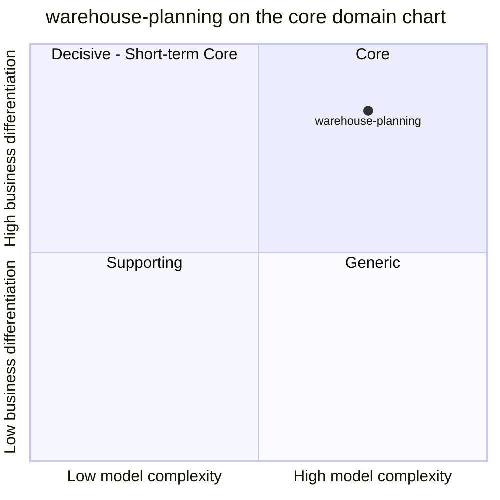

# Core domain chart

Following the ddd-crew [Core Domain Charts](https://github.com/ddd-crew/core-domain-charts):
business differentiation on the vertical axis, model complexity on the
horizontal axis.

Source: `docs/adr/0001-warehouse-planning-bounded-context.md`,
`docs/adr/0002-station-capacity-composition.md`,
`docs/adr/0003-window-coverage-semantics.md`,
`internal/domain/processcapacity/*.go`, `internal/domain/capacityplan/*.go`.
Omits: the sibling contexts (their own charts place them) and the
sub-capabilities of this context, which are not classified separately anywhere.

## Classification: Core

[ADR 0001](/docs/adr/0001-warehouse-planning-bounded-context) introduces
`warehouse-planning` as a new **Core Domain** bounded context, and the fleet
classification agrees. The point sits in the top-right quadrant (Core).

**Business differentiation is high (y = 0.84).** No other fleet context
computes a normalized, cross-process effective capacity or a forward-looking
capacity shortage. `workforce-management` stops at the path boundary,
`facility-layout` knows structure but not throughput, and `inventory-storage`
knows stock, which is not capacity (ADR 0001). The answer "can this warehouse
process the demand assigned to it" is the decision the business acts on when
it re-plans labor or moves demand.

**Model complexity is high (x = 0.74).** Evidence from the code:

- Two aggregates (`ProcessCapacity`, `CapacityPlan`) plus two domain services
  (`ComposeStepCapacity`, `ComposeProcessPathCapacity`) and four value objects
  (`CapacityRate`, `CapacityWindow`, `WorkloadProfile`, `StationStandard`).
- Twenty domain sentinel errors across `internal/domain/**` enforce the rules, among them
  `ErrUnitMismatch`, `ErrMissingStepCapacity`, `ErrUnsupportedNormalizationUnit`,
  `ErrPathRateNotOrder` and `ErrAlreadyPublished`.
- Non-trivial rules that each needed an ADR: read-time station composition
  (`count x StationStandard`, ADR 0002), window **coverage** with
  newest-start-wins per constraint type (ADR 0003), and demand defaulting from
  an order read model where zero orders means *no data* (ADR 0004).
- Normalization across native units (UNIT, PACKAGE, ORDER; LINE rejected)
  through a per-request `WorkloadProfile` before any rate is compared.

It is not further right because the computations are deterministic minimums
over small sets, with no optimisation or forecasting model yet.

## Evolution

**Custom-built**, moving from genesis. The context was created on 2026-10-03
(ADR 0001) and has since changed its core rules three times (ADRs 0002, 0003,
0004). Several parts are still explicit simplifications: the labor window is
derived from the event time, `planned_rate`'s unit is assumed to be UNIT/HOUR,
the `WorkloadProfile` arrives on every request instead of being stored, and
demand is attributed to one configured site. Nothing here is a product or a
commodity; it should stay custom-built while those assumptions are replaced
by real upstream facts.
