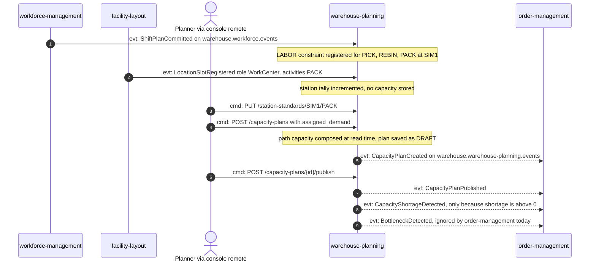
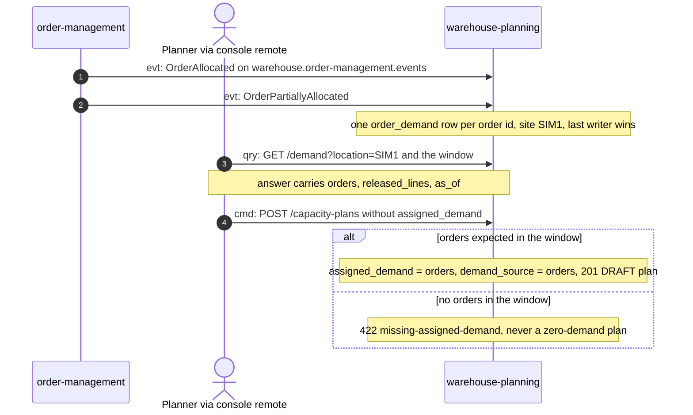
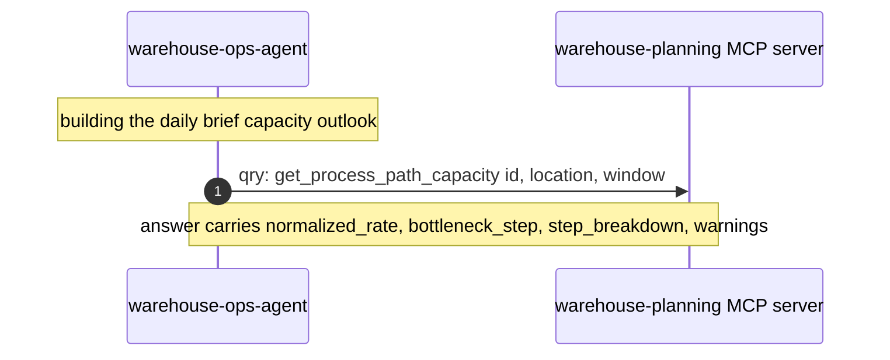

# Domain message flow

Following ddd-crew [Domain Message Flow Modelling](https://github.com/ddd-crew/domain-message-flow-modelling).
Each arrow is numbered and prefixed `cmd:` (command), `evt:` (event) or `qry:`
(query). Only real messages appear: REST routes from `NewRouter`, MCP tools from
`tools.go`, and CloudEvents types from the consumers and the encoder.

## 1. Capacity is known, a plan reveals a shortage, order-management is told

A shift plan is committed, the facility registers packing stations, a planner
declares the per-station standard, then creates and publishes a plan whose
demand exceeds the path capacity.

Source: `internal/adapters/inbound/kafka/labor_capacity_consumer.go`,
`storage_capacity_consumer.go`, `internal/adapters/inbound/http/process_capacity_handler.go`,
`internal/domain/capacityplan/capacity_plan.go`, `internal/adapters/outbound/kafka/encoder.go`;
order-management's `planned_capacity_consumer.go`.
Omits: the outbox relay hop between the commit and Kafka, the analytics copy of
every event, and the order-management consumer being opt-in.

## 2. Demand is defaulted from order-management's orders

The demand consumer is enabled (`DEMAND_CONSUMER_GROUP`, `DEMAND_SITE_ID=SIM1`).
A planner checks the expected demand and creates a plan without stating it.

Source: `internal/adapters/inbound/kafka/order_demand_consumer.go`,
`internal/application/usecases/expected_demand.go`,
`internal/application/usecases/create_capacity_plan.go` (`resolveDemand`),
`internal/domain/demand/order.go`, `docs/adr/0004-demand-ingestion-from-order-management.md`.
Omits: `OrderRepromised` and every other ignored type, and the events the
created plan emits (scenario 1).

## 3. The ops agent reads the capacity outlook over MCP

`warehouse-ops-agent` builds its daily brief from this context's read tools; it
never writes.

Source: `internal/adapters/inbound/mcp/tools.go`, `cmd/mcp/main.go`;
warehouse-ops-agent's `internal/adapters/outbound/mcpclient/warehouse_planning.go`
and its ADR 0013.
Omits: the agent's other wired-but-unused read tools (`get_capacity_plan`,
`get_storage_capacity`, `list_station_standards`) and the agent's own LLM
steps.
