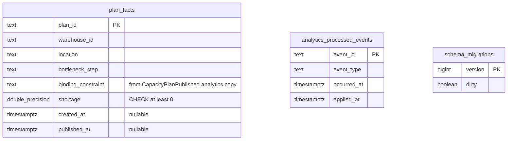

# Entity-relationship diagram

The final schemas after applying every migration in order. This service has
**two** Postgres databases:

- the **OLTP** database (`DATABASE_URL`), migrated by `cmd/api` and `cmd/mcp`
  from `internal/adapters/outbound/postgres/migrations/0001` to `0007`;
- the separate **analytical** database (`ANALYTICS_DATABASE_URL`,
  `warehouse_planning_analytics`), migrated and written only by
  `cmd/planning-projector` from `analytics/migrations/0001` (ADR 0005).

Both are migrated with golang-migrate (`postgres.RunMigrations`), which keeps
its own `schema_migrations` table in each database. There is no top-level
`migrations/` directory in this repository.

## OLTP database

```mermaid
erDiagram
  process_capacity ||--|{ process_capacity_constraint : "has, ON DELETE CASCADE"

  process_capacity {
    text process_type PK
    text location PK
    timestamptz window_start PK
    timestamptz window_end PK
    text native_unit
  }
  process_capacity_constraint {
    text process_type PK,FK
    text location PK,FK
    timestamptz window_start PK,FK
    timestamptz window_end PK,FK
    text constraint_type PK
    double_precision quantity
    double_precision period_seconds
    integer ordinal "registration order"
  }
  capacity_plans {
    text id PK "uuid string"
    text warehouse_id
    text location
    timestamptz window_start
    timestamptz window_end "CHECK end after start"
    text process_path_id "no FK"
    double_precision assigned_demand "CHECK at least 0"
    double_precision path_capacity "ORDER per HOUR"
    text bottleneck_step
    double_precision capacity_over_window
    double_precision shortage "CHECK at least 0"
    text status "DRAFT or PUBLISHED"
    timestamptz created_at
    timestamptz published_at "nullable"
    text bottleneck_constraint "0005, default empty"
    text_array warnings "0005"
    text demand_source "0006, request or orders"
  }
  process_paths {
    text id PK
    text name
    text_array steps "ordered, cardinality above 0"
  }
  station_standards {
    text location PK
    text process_type PK
    double_precision quantity "CHECK above 0"
    text unit
    double_precision period_seconds "CHECK above 0"
    timestamptz updated_at
  }
  location_slot_registration {
    text location_code PK
    text zone_id
    text tally_type "LOCATION or STATION"
    text_array tally_keys
  }
  location_slot_tally {
    text zone_id PK
    text tally_type PK
    text tally_key PK
    integer count "floored at 0"
  }
  order_demand {
    text order_id PK
    text location "DEMAND_SITE_ID"
    timestamptz promise_at
    integer released_lines "CHECK at least 0"
    timestamptz as_of
  }
  processed_events {
    text consumer PK
    text event_id PK
    timestamptz processed_at
  }
  outbox_events {
    bigserial id PK
    text event_id UK "UNIQUE with topic, 0007"
    text topic UK
    text event_type "full CloudEvents type"
    text subject
    bytea key
    text dataschema
    bytea value "structured CloudEvent"
    jsonb headers
    timestamptz created_at
    timestamptz published_at "null until relayed"
    integer attempts
    text last_error
  }
  schema_migrations {
    bigint version PK
    boolean dirty
  }
```

Source: `internal/adapters/outbound/postgres/migrations/0001_process_capacity.up.sql`
through `0007_outbox_event_id_per_topic.up.sql`, `internal/adapters/outbound/postgres/migrate.go`.
Omits: the indexes (`idx_capacity_plans_warehouse_window`,
`idx_outbox_events_unpublished` partial on `published_at IS NULL`,
`idx_order_demand_location_promise`) and column defaults. Types are drawn in
lower case with `_` instead of spaces (`double_precision`, `text_array` for
`TEXT[]`) because Mermaid types cannot contain spaces or brackets.

The **only** foreign key in the schema is
`process_capacity_constraint (process_type, location, window_start, window_end)`
referencing `process_capacity`, with `ON DELETE CASCADE`. Every other link is
logical and deliberately has no foreign key:

- `capacity_plans.process_path_id` names a `process_paths.id`, but a plan
  stores its computed result and must survive a path being re-declared
  (`ProcessPath` is replaced wholesale); the two are different aggregates.
- `capacity_plans.location` and the step `process_type`s line up with
  `process_capacity` rows only through window coverage at creation time; the
  plan never reads them again.
- `station_standards (location, process_type)` and `location_slot_tally`
  (zone ids starting with `<location>-`, `tally_key` = activity) are joined by a
  string prefix at read time (ADR 0002), not by a key.
- `location_slot_registration.(zone_id, tally_type, tally_keys)` remembers
  which `location_slot_tally` buckets a slot incremented, so a decommission
  knows what to decrement.
- `outbox_events.subject` and `key` are the capacity plan id.
- `processed_events.event_id` is the CloudEvents id of a consumed message;
  `consumer` is `labor-capacity-consumer`, `storage-capacity-consumer` or
  `order-demand-consumer`.

## Analytical database

Source: `analytics/migrations/0001_plan_facts.up.sql`,
`internal/adapters/outbound/analyticsstore/postgres_projection.go`.
Omits: the partial indexes `idx_plan_facts_published_at` and
`idx_plan_facts_created_at`. There is no foreign key: `plan_facts.plan_id` is a
capacity plan id from the other database, and
`analytics_processed_events.event_id` is the CloudEvents id applied in the same
transaction as the `plan_facts` upsert.

## Table is not aggregate

| Table | Role | Aggregate / model |
| --- | --- | --- |
| `process_capacity` + `process_capacity_constraint` | Aggregate state (parent + child rows) | `ProcessCapacity` aggregate |
| `capacity_plans` | Aggregate state | `CapacityPlan` aggregate |
| `process_paths` | Operator-declared read model | `processpath.ProcessPath` |
| `station_standards` | Stored value objects | `processcapacity.StationStandard` |
| `location_slot_tally`, `location_slot_registration` | Read model of facility-layout events | facility tally (`internal/application/tally`) |
| `order_demand` | Read model of order-management events | `demand.Order` |
| `processed_events` | **Infrastructure**: consumer idempotency claims | none |
| `outbox_events` | **Infrastructure**: transactional outbox (two rows per domain event since `0007`) | none |
| `schema_migrations` | **Infrastructure**: golang-migrate bookkeeping | none |
| `plan_facts` | **Analytics projection** (separate database) | none (derived from the analytics stream) |
| `analytics_processed_events` | **Infrastructure / analytics**: projector idempotency | none |

There is no `idempotency_keys` table: this service does not implement the fleet
`Idempotency-Key` middleware on its POST endpoints.
