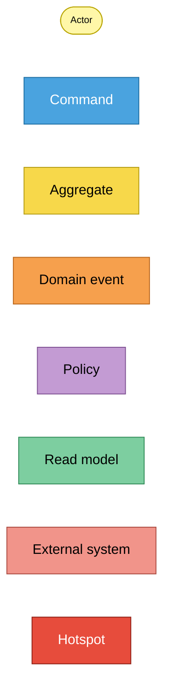
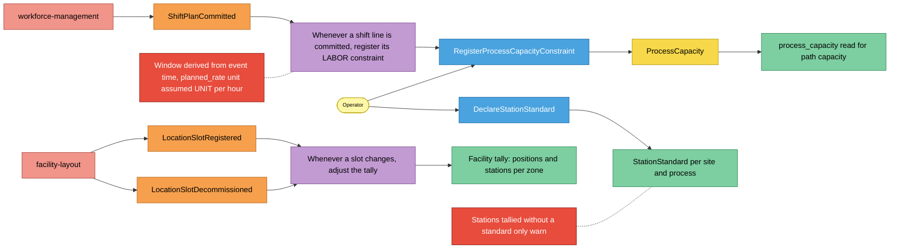
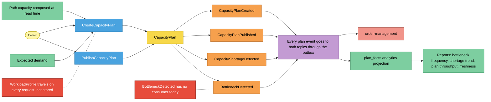
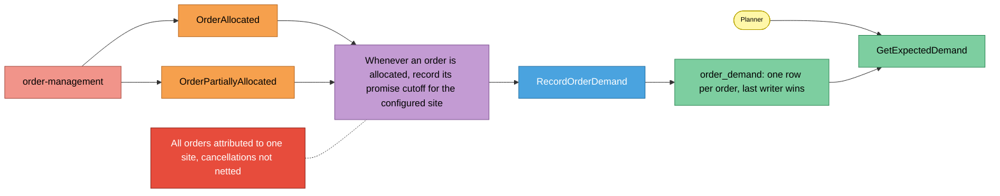

# EventStorming (design level)

Notation from the ddd-crew
[EventStorming glossary and cheat sheet](https://github.com/ddd-crew/eventstorming-glossary-cheat-sheet).
Three processes, each read left to right. Hotspots are real, documented gaps
(ADRs, code comments), not invented ones.

## Legend

Source: ddd-crew cheat-sheet colours as specified for the fleet.
Omits: nothing; this is the key for the three diagrams below.

## 1. Capacity facts arrive from upstream

Source: `internal/adapters/inbound/kafka/labor_capacity_consumer.go`,
`storage_capacity_consumer.go`,
`internal/application/usecases/register_process_capacity_constraint.go`,
`declare_station_standard.go`, `internal/domain/processcapacity/*.go`.
Omits: the processed-event claim and DLQ mechanics (see the
[sequence diagrams](/docs/ddd/sequence-diagrams)) and `RegisterProcessPath`,
which the operator also issues before planning. No domain event is raised by
`ProcessCapacity` itself.

## 2. Plan, publish, announce the shortage

Source: `internal/application/usecases/create_capacity_plan.go`,
`publish_capacity_plan.go`, `internal/domain/capacityplan/*.go`,
`internal/adapters/outbound/kafka/analytics_encoder.go` (`FanoutEncoder`),
`internal/adapters/outbound/analyticsstore/postgres_projection.go`,
`internal/adapters/inbound/http/reports_handler.go`.
Omits: the rejection paths (`ErrAlreadyPublished`, `ErrMissingAssignedDemand`,
`ErrMissingStepCapacity`). `CapacityShortageDetected` and `BottleneckDetected`
are raised only when `shortage > 0`.

## 3. Expected demand from order-management

Source: `internal/adapters/inbound/kafka/order_demand_consumer.go`,
`internal/application/usecases/expected_demand.go`,
`internal/domain/demand/order.go`, ADR 0004.
Omits: `OrderRepromised` (deliberately ignored: no new cutoff instant) and the
opt-in switch `DEMAND_CONSUMER_GROUP`.

## Sticky inventory

| Sticky | Kind | Code evidence |
| --- | --- | --- |
| Operator, Planner | Actor | REST callers (`warehouse-console` remote `web/src/api.ts`) and MCP clients |
| `RegisterProcessCapacityConstraint` | Command | `internal/application/usecases/register_process_capacity_constraint.go` |
| `DeclareStationStandard` | Command | `internal/application/usecases/declare_station_standard.go` |
| `CreateCapacityPlan` | Command | `internal/application/usecases/create_capacity_plan.go` |
| `PublishCapacityPlan` | Command | `internal/application/usecases/publish_capacity_plan.go` |
| `RecordOrderDemand` | Command | `internal/application/usecases/expected_demand.go` |
| `ProcessCapacity` | Aggregate | `internal/domain/processcapacity/process_capacity.go` |
| `CapacityPlan` | Aggregate | `internal/domain/capacityplan/capacity_plan.go` |
| `CapacityPlanCreated`, `CapacityPlanPublished`, `CapacityShortageDetected`, `BottleneckDetected` | Domain event (published) | `internal/domain/capacityplan/events.go`, `internal/adapters/outbound/kafka/encoder.go` |
| `ShiftPlanCommitted` | Domain event (consumed) | `typeShiftPlanCommitted` in `labor_capacity_consumer.go` |
| `LocationSlotRegistered`, `LocationSlotDecommissioned` | Domain event (consumed) | `typeLocationSlotRegistered`, `typeLocationSlotDecommissioned` in `storage_capacity_consumer.go` |
| `OrderAllocated`, `OrderPartiallyAllocated` | Domain event (consumed) | `typeOrderAllocated`, `typeOrderPartiallyAllocated` in `order_demand_consumer.go` |
| Register LABOR on shift commit | Policy | `LaborCapacityConsumer.HandleMessage` |
| Adjust the tally on slot change | Policy | `StorageCapacityConsumer.handleRegistered` / `handleDecommissioned` |
| Record order demand | Policy | `OrderDemandConsumer.HandleMessage` |
| Fan out to both topics through the outbox | Policy | `FanoutEncoder.Encode`, `enqueue` in `create_capacity_plan.go` |
| Path capacity, facility tally, StationStandard, expected demand, `plan_facts`, reports | Read model | `GetProcessPathCapacity`, `location_slot_tally`, `station_standards`, `order_demand`, `plan_facts`, `internal/analytics/report` |
| workforce-management, facility-layout, order-management | External system | the three consumer files above and order-management's `planned_capacity_consumer.go` |
| Derived labor window, assumed UNIT/HOUR | Hotspot | ADR 0001 Addendum; `laborRateUnit` comment in `labor_capacity_consumer.go` |
| Stations without a standard only warn | Hotspot | `ComposeStepCapacity` warning, ADR 0002 |
| WorkloadProfile not stored | Hotspot | `GetProcessPathCapacityCommand` doc comment ("PHASE 2 SIMPLIFICATION") |
| BottleneckDetected without a consumer | Hotspot | order-management's `planned_capacity_consumer.go` ignores it |
| One site, no cancellation netting | Hotspot | ADR 0004, `cmd/api/demand.go` |
