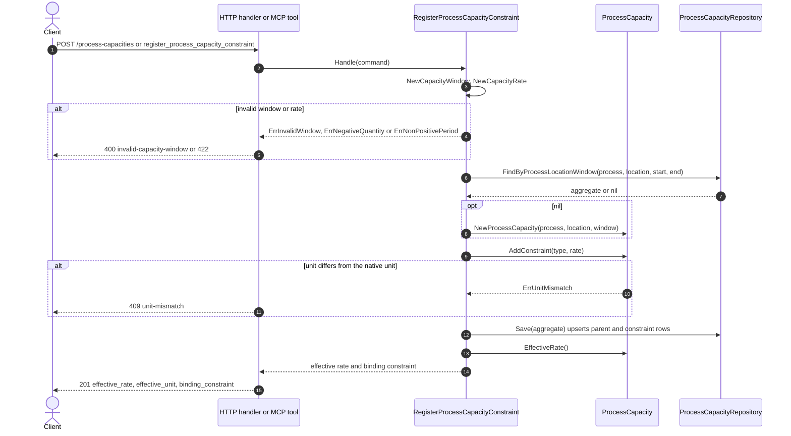
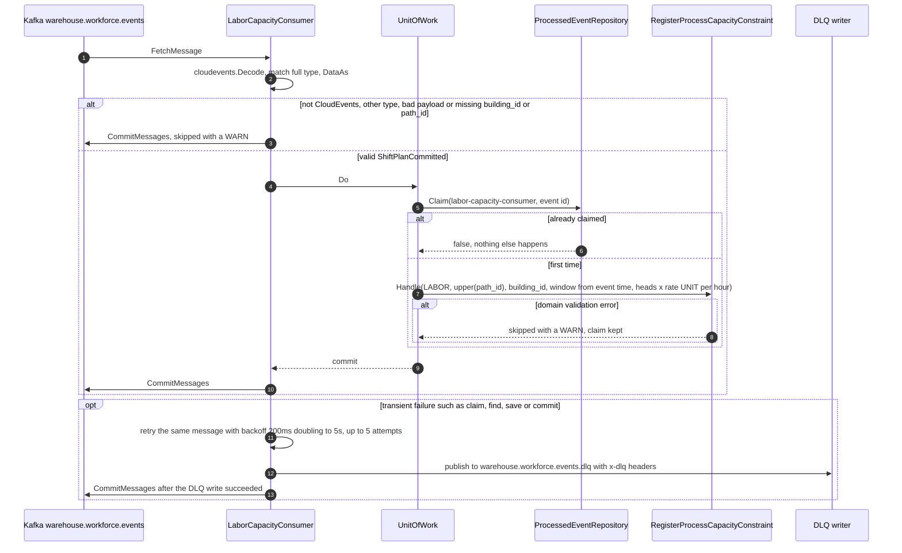
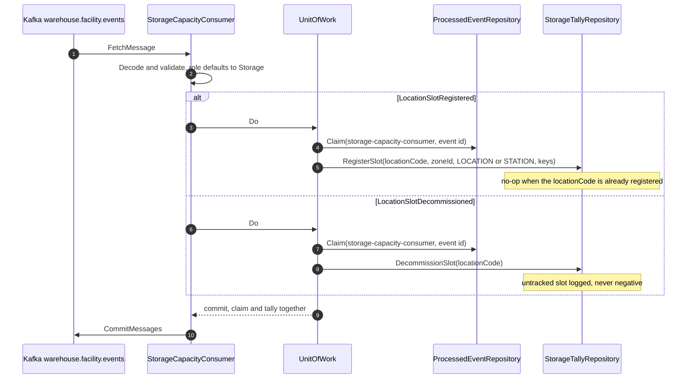
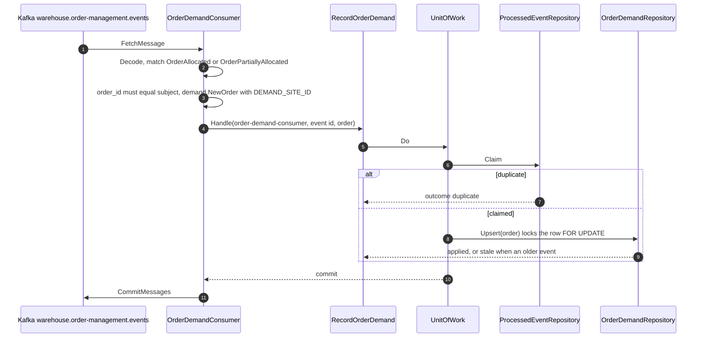
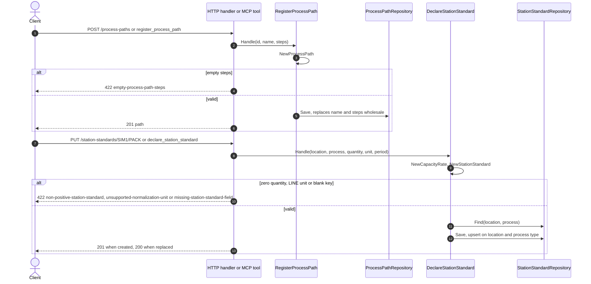
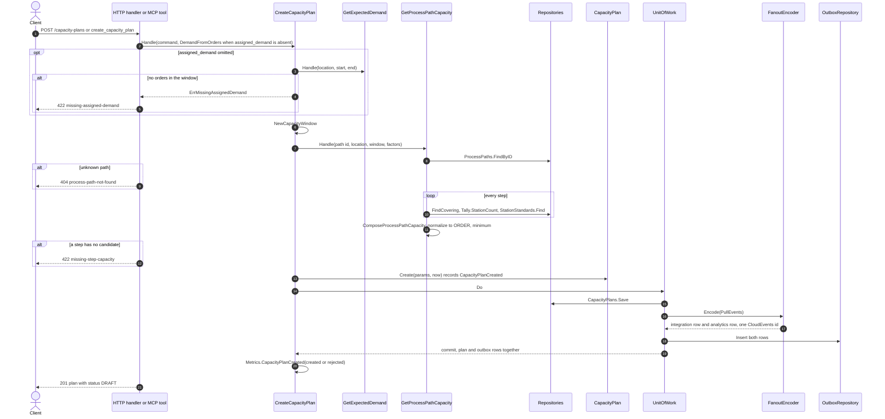
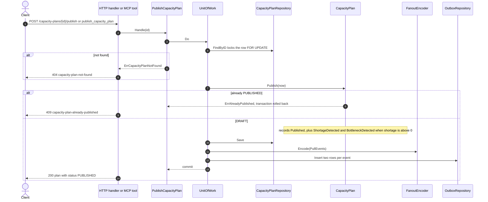
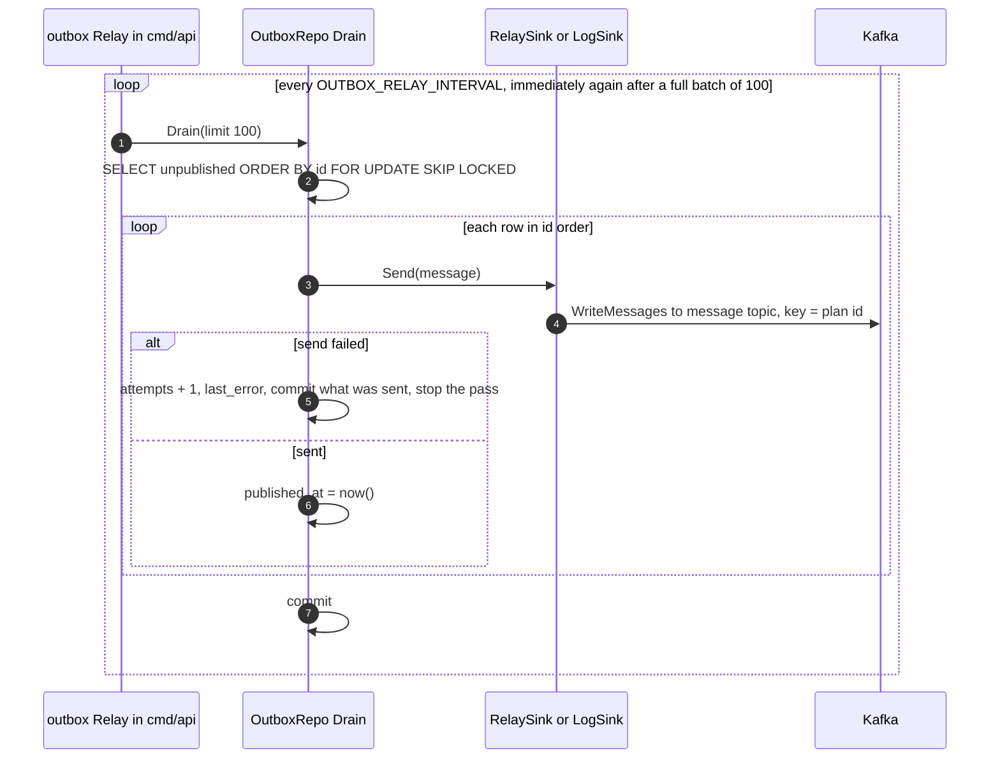
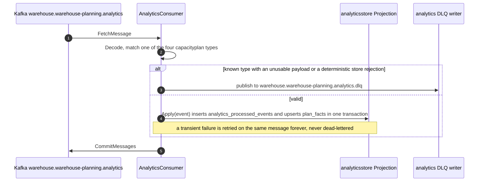

# Sequence diagrams

UML sequence diagrams of every command use case, derived from the use-case
bodies in `internal/application/usecases`, the inbound adapters and the
Postgres adapters. REST and MCP call the **same** use cases; where both exist
the diagram shows REST and names the MCP tool. This service has **no**
`Idempotency-Key` middleware and **no** optimistic version column: concurrent
publishes serialize on a row lock instead.

## 1. Register a process capacity constraint (REST / MCP)

Source: `internal/application/usecases/register_process_capacity_constraint.go`,
`internal/adapters/inbound/http/process_capacity_handler.go`,
`internal/adapters/inbound/mcp/tools.go`,
`internal/adapters/outbound/postgres/process_capacity_repository.go`.
Omits: JSON decoding errors (`400 malformed-json`) and the MCP-only
`non-positive-period` check of `period_seconds` before the use case. There is
no unit of work on this REST path: `Save` runs its own transaction.

## 2. Labor capacity from ShiftPlanCommitted (Kafka)

Source: `internal/adapters/inbound/kafka/labor_capacity_consumer.go`,
`kafka.go` (`consumeLoop`), `deadletter.go`,
`internal/adapters/outbound/postgres/unit_of_work.go`, `processed_event_repository.go`.
Omits: the commit retry loop (an offset commit that fails is retried until it
succeeds) and logging.

## 3. Facility tally from LocationSlotRegistered / Decommissioned (Kafka)

Source: `internal/adapters/inbound/kafka/storage_capacity_consumer.go`,
`internal/adapters/outbound/postgres/storage_tally_repository.go`.
Omits: the skip branches (not CloudEvents, unknown type, missing fields,
unknown role), the duplicate-claim branch and the retry-then-DLQ path to
`warehouse.facility.events.dlq`, all identical to diagram 2. No use case and no
`ProcessCapacity` are involved.

## 4. Expected demand from OrderAllocated (Kafka, opt-in)

Source: `internal/adapters/inbound/kafka/order_demand_consumer.go`,
`internal/application/usecases/expected_demand.go` (`RecordOrderDemand`),
`internal/adapters/outbound/postgres/order_demand_repository.go`,
`internal/domain/demand/order.go`, `cmd/api/demand.go`.
Omits: the skip branches and the retry-then-DLQ path to
`warehouse.order-management.events.dlq` (as diagram 2). The consumer only runs
when `DEMAND_CONSUMER_GROUP` is set.

## 5. Register a process path and declare a station standard (REST / MCP)

Source: `internal/application/usecases/register_process_path.go`,
`declare_station_standard.go`, `internal/adapters/inbound/http/process_path_handler.go`,
`station_handler.go`, `internal/domain/processpath/process_path.go`,
`internal/domain/processcapacity/station_standard.go`.
Omits: JSON decoding errors and the MCP result shapes.

## 6. Create a capacity plan (REST / MCP)

Source: `internal/application/usecases/create_capacity_plan.go`,
`get_process_path_capacity.go`, `expected_demand.go`,
`internal/domain/processcapacity/process_path_capacity.go`, `step_capacity.go`,
`internal/domain/capacityplan/capacity_plan.go`,
`internal/adapters/outbound/kafka/analytics_encoder.go`,
`internal/adapters/inbound/http/capacity_plan_handler.go`.
Omits: the WorkloadProfile errors (`422` factor slugs), `ErrNegativeDemand`,
`ErrRequiredField` and malformed-timestamp `400`s. The metric is recorded for
both outcomes.

## 7. Publish a capacity plan (REST / MCP)

Source: `internal/application/usecases/publish_capacity_plan.go`,
`internal/adapters/outbound/postgres/capacity_plan_repository.go`,
`internal/domain/capacityplan/capacity_plan.go`.
Omits: the in-memory repositories (no row lock; the memory unit of work rolls
participants back on error).

## 8. Outbox relay to Kafka

Source: `internal/adapters/outbound/outbox/relay.go`,
`internal/adapters/outbound/postgres/outbox_repository.go`,
`internal/adapters/outbound/kafka/relay_sink.go`, `cmd/api/main.go`
(`startOutboxRelay`).
Omits: `EVENT_PUBLISHER=log`, where `LogSink` logs and nothing reaches Kafka,
and the lazy first dial of the Kafka writer.

## 9. Analytics projection (cmd/planning-projector)

Source: `internal/adapters/inbound/kafka/analytics_consumer.go`,
`internal/adapters/outbound/analyticsstore/postgres_projection.go`,
`cmd/planning-projector/main.go`, ADR 0005.
Omits: not-CloudEvents and other-type messages (skipped with a rate-limited
WARN) and the read side (`cmd/planning-reports`), which only queries.
