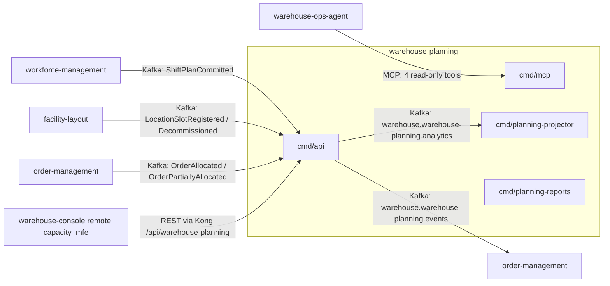

# Upstream and downstream contracts

Every edge between `warehouse-planning` and the rest of the fleet: which
protocol, which contract, and what happens when it fails. The consumed event
shapes were confirmed against each producer's own `apis/asyncapi.yaml` (see
the Addendum of
[ADR 0001](/docs/adr/0001-warehouse-planning-bounded-context)) rather than
guessed.

## At a glance

Source: `cmd/api/main.go`, `cmd/api/demand.go`, `cmd/mcp/main.go`,
`cmd/planning-projector/main.go`, `internal/adapters/inbound/kafka/*_consumer.go`,
`internal/adapters/outbound/kafka/encoder.go`, `web/src/api.ts`.
Omits: the DLQ topics, Postgres and the OTel Collector.

| Direction | Counterpart | Protocol | Contract | Failure behaviour |
| --- | --- | --- | --- | --- |
| upstream | `workforce-management` | Kafka, `warehouse.workforce.events` | `com.warehouse.wes.workforce-management.shiftplan.ShiftPlanCommitted` | transient errors retried 5 times, then `warehouse.workforce.events.dlq` |
| upstream | `facility-layout` | Kafka, `warehouse.facility.events` | `...facility-layout.locationslot.LocationSlotRegistered`, `...LocationSlotDecommissioned` | same, `warehouse.facility.events.dlq` |
| upstream | `order-management` | Kafka, `warehouse.order-management.events` | `...order-management.order.OrderAllocated`, `...OrderPartiallyAllocated` | same, `warehouse.order-management.events.dlq`; consumer off unless `DEMAND_CONSUMER_GROUP` is set |
| inbound caller | `warehouse-console` (remote `capacity_mfe` from `web/`) | REST through Kong at `/api/warehouse-planning` | `apis/openapi.yaml` ([API reference](/docs/api-reference)) | RFC 7807 problem responses (`application/problem+json`); the call fails, nothing is retried by this service |
| inbound caller | `warehouse-ops-agent` | MCP (Streamable HTTP, `cmd/mcp` on `:8090`) | `get_process_path_capacity`, `get_capacity_plan`, `get_storage_capacity`, `list_station_standards` ([MCP tools](/docs/mcp/tools)) | the tool returns an error result; how the agent degrades is that repo's concern |
| downstream | `order-management` | Kafka, `warehouse.warehouse-planning.events` | the four `com.warehouse.wes.warehouse-planning.capacityplan.*` types ([event catalogue](/docs/api-reference/events)) | outbox: the row stays unpublished and is retried every relay pass |
| internal | `cmd/planning-projector` | Kafka, `warehouse.warehouse-planning.analytics` | the same four types ([ADR 0005](/docs/adr/0005-analytics-read-side)) | outbox as above; projector DLQ `warehouse.warehouse-planning.analytics.dlq` |

There are **no outbound REST or MCP calls**: no adapter under
`internal/adapters/outbound` opens an HTTP client to a sibling context. Every
fact this context needs from another context arrives as a Kafka event.

## Envelope

Every message in both directions is a CloudEvents 1.0 event in **structured
mode**: the whole envelope is the Kafka value and the `content-type` header is
`application/cloudevents+json; charset=UTF-8`
(`internal/adapters/kafka/cloudevents/cloudevents.go`). Consumers match on the
**full** CloudEvents `type`; unknown types on a topic are ignored. A message
that is not a valid CloudEvent (including the retired flat envelope) is
logged and skipped.

## Upstream: workforce-management

| | |
| --- | --- |
| Type | `com.warehouse.wes.workforce-management.shiftplan.ShiftPlanCommitted` |
| Topic | `warehouse.workforce.events` |
| Consumer group | `LABOR_CAPACITY_CONSUMER_GROUP` (default `warehouse-planning-labor-capacity`) |
| Fan-out | one message per PathPlan line of a committed ShiftPlan |
| Fields used | `building_id`, `path_id`, `planned_heads`, `planned_rate`, `planned_hours` |
| Effect | a `LABOR` constraint on the ProcessCapacity of ProcessType = upper-case(`path_id`) at Location = `building_id` |
| Rate | `planned_heads * planned_rate`, registered as `UNIT/HOUR` (a documented default; the native unit of `planned_rate` is not specified upstream) |
| Window | `[event.time, event.time + planned_hours)` (a documented assumption: no real shift-start field exists upstream yet) |

This is the **only** thing the consumers register as a ProcessCapacity
constraint.

## Upstream: facility-layout

| | |
| --- | --- |
| Types | `com.warehouse.wms.facility-layout.locationslot.LocationSlotRegistered` and `...LocationSlotDecommissioned` |
| Topic | `warehouse.facility.events` |
| Consumer group | `STORAGE_CAPACITY_CONSUMER_GROUP` (default `warehouse-planning-storage-capacity`) |
| Fields used | `locationCode`, `zoneId`, `locationType`, `role` (default `Storage`), `activities` (present only when `role=WorkCenter`) |
| Effect | maintains a tally: storage positions per `(zoneId, locationType)` for `role=Storage`, stations per zone and activity for `role=WorkCenter`; decommissioning decrements the same tally |

The facility consumer is a pure tally maintainer: it registers no
ProcessCapacity, no sentinel process type and no fake unit. Station counts
become capacity only at read time, composed with an operator-declared
StationStandard
([capacity composition](/docs/overview/capacity-composition)).

## Upstream: order-management

[ADR 0004](/docs/adr/0004-demand-ingestion-from-order-management). The
consumer is **off** unless `DEMAND_CONSUMER_GROUP` is set; it then requires
`DEMAND_SITE_ID`, and the binary exits at boot without it.

| | |
| --- | --- |
| Types | `com.warehouse.wes.order-management.order.OrderAllocated` and `com.warehouse.wes.order-management.order.OrderPartiallyAllocated` |
| Topic | `warehouse.order-management.events` |
| Consumer group | `DEMAND_CONSUMER_GROUP` (no default) |
| Fields used | `order_id` (must equal the CloudEvents `subject`), `promise_date`, `len(lines)`, and the CloudEvents `time` |
| Effect | upserts one `order_demand` row per order id (last writer wins on `time`); every order is attributed to the one configured site `DEMAND_SITE_ID`, because the events carry no fulfillment site |
| Ignored | `OrderRepromised` (no new cutoff instant) and every other type on the topic |

Demand is therefore counted in orders (no units) and not netted for
cancellations. It is read by `GET /demand`, the `get_expected_demand` MCP tool
and `POST /capacity-plans` when `assigned_demand` is omitted.

## Consumer failure behaviour and dead-letter topics

Each consumed message's idempotency claim (`processed_events`, keyed on the
CloudEvents `id`) and its effect commit in one transaction, so a redelivered
message is a no-op. A message whose handling keeps failing transiently
(database begin, claim, upsert or commit) is retried up to 5 times with
backoff and then published to `<topic>.dlq` (`warehouse.workforce.events.dlq`,
`warehouse.facility.events.dlq`, `warehouse.order-management.events.dlq`) with
`x-dlq-*` headers ([ADR 0007](/docs/adr/0007-outbox-and-resilient-consumers)).
Deterministic problems (not a CloudEvent, unknown type, malformed payload,
missing fields) are logged and skipped, never dead-lettered. If
`KAFKA_BROKERS` is unset, the labor and storage consumers do not start (a WARN
line at boot) and REST keeps working on whatever is already stored. See the
[runbook](/docs/operations/runbook) for replays and the
[troubleshooting](/docs/operations/troubleshooting) page for DLQ growth.

## Inbound callers: REST and MCP

- **warehouse-console.** The `web/` Module Federation remote (`capacity_mfe`)
  calls this service through Kong at `/api/warehouse-planning`, using the
  routes in `web/src/api.ts`: storage capacity, station standards (list and
  `PUT`), demand, process paths and their capacity, and capacity plans (list,
  create, publish). Standalone `web/` dev calls `http://localhost:8080`
  directly and needs `CORS_ALLOWED_ORIGINS`.
- **warehouse-ops-agent.** Its MCP client
  (`internal/adapters/outbound/mcpclient/warehouse_planning.go` in that repo)
  calls four read-only tools: `get_process_path_capacity`,
  `get_capacity_plan`, `get_storage_capacity` and `list_station_standards`.
  The agent calls none of the write tools of `cmd/mcp` (its
  `internal/architecture/zerowrite` test pins that).

REST and MCP are unauthenticated, as everywhere in the fleet.

## Downstream: capacity-plan events

The four CapacityPlan events (`CapacityPlanCreated`, `CapacityPlanPublished`,
`CapacityShortageDetected`, `BottleneckDetected`) are published on
`warehouse.warehouse-planning.events` (see the
[event catalogue](/docs/api-reference/events)). The Kafka key is the plan id,
so one plan's events stay on one partition. They are written to the outbox in
the same transaction as the aggregate and sent by the `cmd/api` relay with
`RequireAll` acks. Delivery is at-least-once; consumers must dedupe on the
CloudEvents `id`. If the broker is down the rows stay unpublished and the next
relay pass retries them; plans written by `cmd/mcp` reach Kafka only while a
`cmd/api` pod runs the relay with `EVENT_PUBLISHER=kafka`.

The follow-up change ADR 0001 anticipated has landed in `order-management`
(its `internal/adapters/inbound/kafka/planned_capacity_consumer.go`), which
acts on `CapacityPlanCreated`, `CapacityPlanPublished` and
`CapacityShortageDetected` and ignores `BottleneckDetected`.

The same four types are also written to `warehouse.warehouse-planning.analytics`,
consumed only by this repo's own `cmd/planning-projector` (consumer group
`ANALYTICS_CONSUMER_GROUP`, default `warehouse-planning-analytics`).

## Absent edges

- **process-path-management: deliberately not consumed.** Its `ProcessPath`
  carries `path_id`, `required_capabilities` and eligibility metadata but no
  ordered physical step sequence, so there is nothing structural to sync. This
  context owns its own `ProcessPath`, declared via `POST /process-paths`; the
  two share the `path_id` string only as a loose cross-reference.
- **inventory-storage, wes-work-planning, fulfillment-execution,
  labor-performance and the other contexts:** no edge in either direction.
- **No synchronous calls out.** Nothing here calls another context over REST
  or MCP, so no circuit breaker or HTTP retry policy exists in this repo.

The whole slice is drawn on the [Context map](/docs/ddd/context-map).
