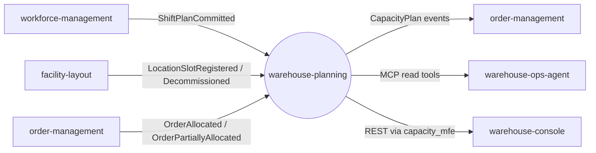

# Bounded context

## Purpose

`warehouse-planning` evaluates whether a warehouse can process the demand
assigned to it. It composes the capacity constraints that sibling contexts and
operators make known, normalizes them to one comparable flow unit, and reports
the effective end-to-end capacity of a process path, the bottleneck step, and
the shortage of a planning window.

The decision to create it as a separate context (rather than extending an
existing service) is [ADR 0001](/docs/adr/0001-warehouse-planning-bounded-context):
`workforce-management` explicitly stops at the path boundary, and no other
context combined labor, station and location constraints.

## Context map

ADR 0001 records the intended relationships (Customer/Supplier unless noted);
ADR 0004 added demand ingestion. The full slice of the context map, with the
DDD pattern of every edge and its code evidence, is on the
[Context map](/docs/ddd/context-map) page.

| Relationship | Direction | Status |
| --- | --- | --- |
| `workforce-management` to `warehouse-planning` | labor via Kafka (`ShiftPlanCommitted`) | implemented (consumer) |
| `facility-layout` to `warehouse-planning` | storage positions and stations via Kafka (`LocationSlotRegistered`, `LocationSlotDecommissioned`) | implemented (consumer, tally only) |
| `order-management` to `warehouse-planning` | expected demand via Kafka (`OrderAllocated`, `OrderPartiallyAllocated`) | implemented (consumer, off unless `DEMAND_CONSUMER_GROUP` is set; ADR 0004) |
| `process-path-management` to `warehouse-planning` | `path_id` as a loose human cross-reference | deliberately **not** consumed (ADR 0001 Addendum) |
| `warehouse-planning` to `order-management` | `CapacityPlanCreated`, `CapacityPlanPublished`, `CapacityShortageDetected`, `BottleneckDetected` | implemented (producer); `order-management` consumes them (its `planned_capacity_consumer.go`) |
| `warehouse-planning` to `warehouse-ops-agent` | read-only MCP tools (`get_process_path_capacity`, `get_capacity_plan`, `get_storage_capacity`, `list_station_standards`) | implemented (the agent's MCP client) |
| `warehouse-planning` to `warehouse-console` | REST through the `capacity_mfe` remote in `web/` | implemented |
| `fulfillment-execution`, `wes-work-planning`, `network-fulfillment` | observed capacity feedback and demand ingestion | planned in ADR 0001, **not** implemented |
| `product-master` | none: SKU master data (handling classification, unit dimensions) is not a capacity input | no relationship in either direction |

## No live cross-context lookup

The service never makes a synchronous REST or MCP call to a sibling bounded
context to answer a capacity question. Capacity-relevant facts are ingested
as published Kafka events and kept as local read models, so a capacity
decision stays available and fast even when an upstream context is degraded.
`inventory-storage` stock levels are explicitly excluded: stock is not
capacity.

## Runtime surface

- `cmd/api` serves REST on `HTTP_ADDR` (default `:8080`), runs the Kafka
  consumers and the outbox relay, and applies the idempotent migrations on
  start.
- `cmd/mcp` serves an MCP server (11 tools) over Streamable HTTP on `MCP_ADDR`
  (default `:8090`, mounted at `/` and `/mcp`, with `GET /healthz`). It uses
  the same use cases and repositories as REST, never dials Kafka and never
  starts the outbox relay: the relay in `cmd/api` drains the outbox rows that
  MCP create and publish calls insert.
- `cmd/planning-projector` (admin `:8091`, `/healthz` `/readyz`) is the analytics
  read side's only writer: it consumes `warehouse.warehouse-planning.analytics`
  and projects into the separate analytical database (ADR 0005).
  `cmd/planning-reports` (`:8092`, `/healthz`) serves the four read-only
  `/reports/...` endpoints from it (`bottleneck-frequency`, `shortage-trend`,
  `plan-throughput` and `freshness`).
- Without `DATABASE_URL`, `cmd/api` and `cmd/mcp` fall back to in-memory
  repositories (the analytics binaries require `ANALYTICS_DATABASE_URL`).
- A Helm chart (`charts/warehouse-planning`) deploys the `api` component, and
  optionally the `mcp`, `frontend` and analytics components (off by default).

Telemetry is pushed over OTLP (`OTEL_EXPORTER_OTLP_ENDPOINT`, ADR 0011) by
`cmd/api`, `cmd/mcp` and `cmd/planning-reports`; no binary serves a `/metrics`
endpoint, and `cmd/planning-projector` sets up no telemetry yet.
