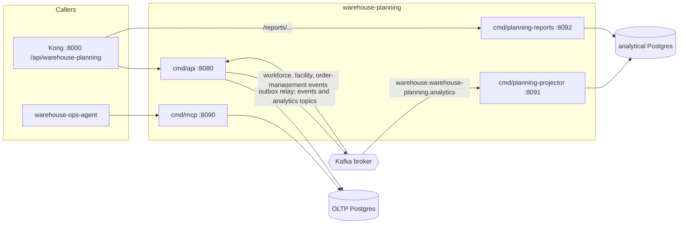

# Runtime and integration mechanics

## Layers

Hexagonal architecture, enforced by architecture tests in
`internal/architecture`:

| Layer | Path |
| --- | --- |
| Domain | `internal/domain/{processcapacity,capacityplan,processpath,demand}` |
| Application (use cases, ports) | `internal/application/{usecases,ports,outbox,tally}` |
| Inbound adapters | `internal/adapters/inbound/{http,kafka,mcp}` |
| Outbound adapters | `internal/adapters/outbound/{postgres,memory,kafka,outbox,analyticsstore,telemetry}` |
| CloudEvents helper | `internal/adapters/kafka/cloudevents` |
| Analytics read side | `internal/analytics/report` (never imported by the OLTP layers) |
| Composition roots | `cmd/api`, `cmd/mcp`, `cmd/planning-projector`, `cmd/planning-reports` |

The [class diagrams](/docs/ddd/class-diagram) show the domain types and the
ports with their adapters.

## Binaries, ports and data stores

| Binary | Role | Port (default) | Probes | Data store |
| --- | --- | --- | --- | --- |
| `cmd/api` | REST API, the three domain Kafka consumers, the outbox relay | `HTTP_ADDR` `:8080` | `/healthz`, `/readyz` | OLTP Postgres (`DATABASE_URL`; in-memory when unset) |
| `cmd/mcp` | MCP server (Streamable HTTP, 11 tools); writes outbox rows but never relays them | `MCP_ADDR` `:8090` (`/` and `/mcp`) | `/healthz` | the same OLTP Postgres |
| `cmd/planning-projector` | the only writer of the analytical database, fed by `warehouse.warehouse-planning.analytics` | `ADMIN_ADDR` `:8091` (admin only) | `/healthz`, `/readyz` | analytical Postgres (`ANALYTICS_DATABASE_URL`, read-write) |
| `cmd/planning-reports` | read-only `GET /reports/...` over the analytical database | `HTTP_ADDR` `:8092` | `/healthz` | analytical Postgres (`ANALYTICS_DATABASE_URL`, read-only transactions) |

`cmd/api` and `cmd/mcp` both run the OLTP migrations at boot
(`MIGRATIONS_DATABASE_URL`, falling back to `DATABASE_URL`); the projector runs
the analytical ones. Every variable is listed on
[Configuration](/docs/operations/configuration), and the probes are explained
in the [runbook](/docs/operations/runbook).

Source: `cmd/api/main.go`, `cmd/mcp/main.go`, `cmd/mcp/router.go`,
`cmd/planning-projector/main.go`, `cmd/planning-reports/main.go`.
Omits: the DLQ topics, the OTel Collector and the `web/` remote's own nginx
workload.

## Publishing: transactional outbox

There is no dual write. `CreateCapacityPlan` and `PublishCapacityPlan` each run
one unit of work that saves the aggregate **and** inserts the already encoded
CloudEvents into `outbox_events`. The CloudEvents `id` is minted once at
encoding and persisted, so a relay retry republishes the same bytes and id.

The relay in `cmd/api` drains the table every `OUTBOX_RELAY_INTERVAL` (default
`1s`), claiming rows `FOR UPDATE SKIP LOCKED` in id order, sending one at a
time and stopping at the first failure, so a later event for a plan never
overtakes an earlier one. Delivery is at-least-once; consumers dedupe on `id`.
`EVENT_PUBLISHER=kafka|log` (default `log`) selects the Kafka sink or a log
sink; `kafka` requires `KAFKA_BROKERS`. Kafka is dialled lazily by the first
send, never at boot.

## Consuming: at-least-once with an atomic effect

- Offsets are committed only after a message was handled successfully
  (`FetchMessage` plus `CommitMessages`); transient failures retry the same
  message with capped exponential backoff.
- The processed-event claim (keyed by consumer and CloudEvents id) and every
  side effect commit or roll back together in one unit of work, so a
  rolled-back handling un-claims and the redelivery is processed.
- Only transient or infrastructure failures return an error. Deterministic
  problems (not a CloudEvent, unknown type, malformed payload, duplicate id,
  domain-validation rejections) are skipped.
- Consumer group ids come from environment variables
  (`LABOR_CAPACITY_CONSUMER_GROUP`, `STORAGE_CAPACITY_CONSUMER_GROUP`,
  `DEMAND_CONSUMER_GROUP`, and the projector's `ANALYTICS_CONSUMER_GROUP`),
  never from string literals. The order-demand consumer is off unless
  `DEMAND_CONSUMER_GROUP` is set, and then requires `DEMAND_SITE_ID`.

Dead-lettering ([ADR 0007](/docs/adr/0007-outbox-and-resilient-consumers) §3,
`internal/adapters/inbound/kafka/deadletter.go`): the three domain consumers
retry a transient failure on the same message up to 5 times, then publish it to
`<topic>.dlq` (`warehouse.workforce.events.dlq`,
`warehouse.facility.events.dlq`, `warehouse.order-management.events.dlq`) with
`x-dlq-*` headers and commit past it. The DLQ publish itself is retried until it
succeeds, so nothing is silently dropped. The analytics projector is different
by design ([ADR 0005](/docs/adr/0005-analytics-read-side)): a transient failure
is retried forever and never dead-lettered; only a known type with an unusable
payload or a deterministic store rejection goes to
`warehouse.warehouse-planning.analytics.dlq`.

## CloudEvents envelope

Every Kafka message is a CloudEvents 1.0 event in structured content mode with
the header `content-type: application/cloudevents+json; charset=UTF-8`. See the
[event catalogue](/docs/api-reference/events) for attributes and types.

## MCP

`cmd/mcp` exposes 11 tools (budget is 11, pinned by `maxTools` in
`internal/adapters/inbound/mcp/governance_test.go`):
`register_process_capacity_constraint`, `get_effective_process_capacity`,
`register_process_path`, `get_process_path_capacity`, `create_capacity_plan`,
`publish_capacity_plan`, `get_capacity_plan`, `declare_station_standard`,
`list_station_standards`, `get_storage_capacity` and `get_expected_demand`. Arguments are snake_case, matching the REST bodies;
failures are MCP tool errors whose text is `<slug>: <message>` using the REST
problem slugs.
